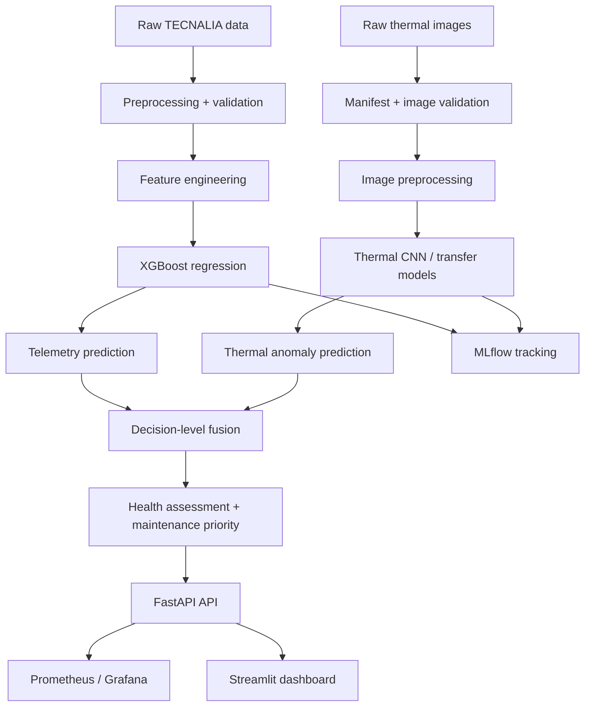

# Solar PV Multimodal Maintenance

An end-to-end photovoltaic maintenance system that combines telemetry regression and thermal anomaly detection into a decision-support platform for solar asset monitoring.

## Overview

This project builds two independent AI pipelines:

- TECNALIA telemetry branch: classical ML and regression for normalized power estimation
- RaptorMaps thermal branch: deep learning for PV anomaly classification from infrared images

Both branches are trained independently and fused at the decision layer to produce a maintenance recommendation rather than a paired multimodal model.

## Key capabilities

- telemetry preprocessing and feature engineering
- XGBoost regression for PV performance prediction
- thermal image validation and anomaly classification
- decision-level fusion and health assessment
- model provenance with MLflow
- FastAPI inference endpoints
- Streamlit dashboard for demo and review
- Docker Compose deployment with Prometheus and Grafana
- test coverage for API and runtime contracts

## Architecture



## Dataset constraint

The TECNALIA and RaptorMaps datasets are independent and not paired by asset, timestamp, or module identity. The project therefore does not train a paired multimodal model. Instead, it fuses prediction outputs after independent inference.

## Project structure

```text
.
├── api/
├── dashboard/
├── data/
├── docs/
├── monitoring/
├── reports/
├── scripts/
├── src/
├── tests/
├── docker-compose.yml
├── requirements.txt
├── pyproject.toml
├── README.md
├── ARCHITECTURE.md
├── API.md
├── DEPLOYMENT.md
├── DASHBOARD.md
├── TESTING.md
└── FINAL_TECHNICAL_DOCUMENTATION.md
```

## Setup

```bash
cd /home/jyothika/projects/Solar_PV_Multimodal_Maintenance
python -m venv .venv
. .venv/bin/activate
python -m pip install --upgrade pip
python -m pip install -r requirements.txt
```

> For direct script execution, run from the repo root and set `PYTHONPATH=.`.

## Train the TECNALIA model

```bash
cd /home/jyothika/projects/Solar_PV_Multimodal_Maintenance
. .venv/bin/activate
PYTHONPATH=. python scripts/train_tecnalia_xgboost.py
```

This produces outputs such as:

- `reports/results/tecnalia/xgboost/xgboost_metrics.csv`
- `reports/results/tecnalia/xgboost/test_predictions.csv`

## Start the API

```bash
cd /home/jyothika/projects/Solar_PV_Multimodal_Maintenance
. .venv/bin/activate
PYTHONPATH=. uvicorn api.app:app --host 0.0.0.0 --port 8000 --reload
```

Open the Swagger UI:

- `http://localhost:8000/docs`

### API endpoints

- `GET /api/v1/health`
- `POST /api/v1/tecnalia/predict`
- `POST /api/v1/raptormaps/predict`
- `POST /api/v1/fusion`
- `POST /api/v1/fusion/health`

## Start the dashboard

```bash
cd /home/jyothika/projects/Solar_PV_Multimodal_Maintenance
. .venv/bin/activate
streamlit run dashboard/solar_pv_dashboard.py --server.headless true --server.port 8501
```

Open:

- `http://localhost:8501`

## Monitoring and deployment

Launch the local stack with Docker Compose:

```bash
docker compose up --build
```

Available services:

- API: `http://localhost:8000/docs`
- MLflow: `http://localhost:5000`
- Prometheus: `http://localhost:9090`
- Grafana: `http://localhost:3000`

## Example telemetry request

```bash
curl -X POST "http://localhost:8000/api/v1/tecnalia/predict" \
  -H "Content-Type: application/json" \
  -d '{
    "model_name": "gradient_boosting_tuned",
    "model_version": "latest",
    "module_name": "Atersa",
    "features": {
      "Front GPOA (W/m²)": 650.0,
      "GHI (W/m²)": 540.0,
      "Temp. Mod (°C)": 28.0,
      "Amb. Temp. (°C)": 26.0,
      "Wind Speed (m/s)": 2.4
    }
  }'
```

## Example health assessment request

```bash
curl -X POST "http://localhost:8000/api/v1/fusion/health" \
  -H "Content-Type: application/json" \
  -d '{
    "telemetry_prediction": {
      "predicted_normalized_pmpp": 0.82,
      "provenance": {
        "model_name": "gradient_boosting_tuned",
        "model_version": "latest",
        "checkpoint_path": "models/tecnalia/final_model.joblib",
        "validation_metric_name": "mae",
        "validation_metric_value": 0.03
      }
    },
    "thermal_prediction": {
      "anomaly_class": "Hot-Spot",
      "anomaly_confidence": 0.8,
      "class_probabilities": {
        "Hot-Spot": 0.8,
        "No-Anomaly": 0.2,
        "Cell": 0.0,
        "Cell-Multi": 0.0,
        "Cracking": 0.0,
        "Diode": 0.0,
        "Diode-Multi": 0.0,
        "Shadowing": 0.0,
        "Soiling": 0.0,
        "Vegetation": 0.0,
        "Offline-Module": 0.0,
        "Hot-Spot-Multi": 0.0
      },
      "provenance": {
        "model_name": "SolarPV_RaptorMaps_ResNet18",
        "model_version": "1",
        "checkpoint_path": "models/raptormaps/resnet18_finetune/best_model.pt",
        "checkpoint_epoch": 14,
        "validation_metric_name": "macro_f1",
        "validation_metric_value": 0.650738
      }
    },
    "actual_normalized_pmpp": 0.72,
    "embedding_indicators": {"embedding_distance": 0.42}
  }'
```

## Validation

Run the tests:

```bash
cd /home/jyothika/projects/Solar_PV_Multimodal_Maintenance
. .venv/bin/activate
python -m pytest -q
```

Validated project results from the current environment:

- API + integration checks: 8 passed in 2.71s
- training pipeline executed successfully with `PYTHONPATH=.`

## Key metrics

Telemetry model performance from the project training run:

- validation MAE: 0.0371
- validation RMSE: 0.0655
- validation R²: 0.8986
- test MAE: 0.0464
- test RMSE: 0.0739
- test R²: 0.8935

## Limitations

- the datasets are not paired, so the system uses decision-level fusion instead of paired multimodal training
- health output is a decision-support signal, not a calibrated physical health percentage
- thermal classes can be imbalanced and harder to separate in practice
- scripts rely on the repository root being correctly configured for Python imports

## Resume-ready summary

This project develops an end-to-end photovoltaic predictive maintenance platform that combines telemetry regression and thermal anomaly detection into a unified decision-support system. It preprocesses PV performance data, trains classical and deep learning models, fuses their outputs at the decision layer, and exposes results through a FastAPI API and dashboard. The system integrates MLflow tracking, deployment orchestration, Prometheus monitoring, and Grafana visualization for operational review.
